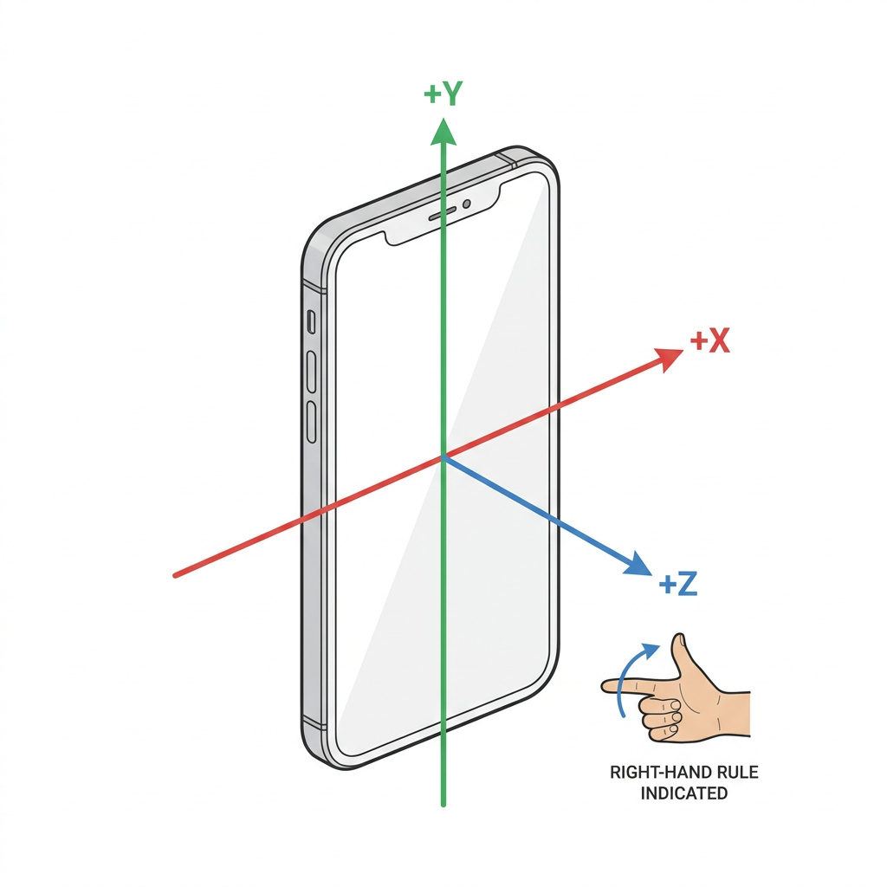

# 运动类传感器

运动类传感器是智能手机中最基础、最核心的传感器类别。它们基于 **MEMS (微机电系统)** 技术,能够感知设备的加速度、角速度和地磁场方向。

---

## 本章概要

| 传感器 | 物理量 | 单位 | 自由度 | 核心原理 |
|:-------|:-------|:-----|:------:|:---------|
| 加速度计 | 线性加速度 | m/s² | 3轴 | 质量块惯性位移 → 电容变化 |
| 陀螺仪 | 角速度 | rad/s | 3轴 | 科氏力偏转 → 电容变化 |
| 磁力计 | 磁场强度 | μT | 3轴 | 霍尔效应 / 磁阻效应 |

三者合称 **9轴惯性测量单元 (9-axis IMU)**,是实现运动追踪、姿态估计、导航定位的基础。

---

## 在手机中的典型应用

| 应用场景 | 主要传感器 | 说明 |
|:---------|:----------|:-----|
| 屏幕自动旋转 | 加速度计 | 检测重力方向判断横竖屏 |
| 计步器 | 加速度计 | 检测行走时的周期性加速度模式 |
| 图像防抖 (OIS/EIS) | 陀螺仪 | 检测手持抖动,补偿相机运动 |
| 指南针/地图朝向 | 磁力计 | 检测地磁场方向 |
| AR/VR 头部追踪 | 加速度计 + 陀螺仪 | 6DoF 运动追踪 |
| 惯性导航 | 加速度计 + 陀螺仪 + 磁力计 | 室内定位辅助 |
| 体感游戏 | 加速度计 + 陀螺仪 | 倾斜、旋转控制 |
| 跌倒检测 | 加速度计 | 检测自由落体后的冲击 |

---

## 坐标系定义

智能手机的运动传感器使用统一的 **设备坐标系**:

<figure markdown="span">
  { width="500" }
  <figcaption>智能手机设备坐标系定义 (右手坐标系)</figcaption>
</figure>

- **X 轴**: 沿屏幕宽度方向,向右为正
- **Y 轴**: 沿屏幕高度方向,向上为正
- **Z 轴**: 垂直于屏幕平面,朝向用户为正
- 符合 **右手坐标系** 定则

!!! warning "注意"
    当手机旋转(横屏)时,设备坐标系随手机旋转,而非固定于世界坐标系。开发时需注意坐标变换。
