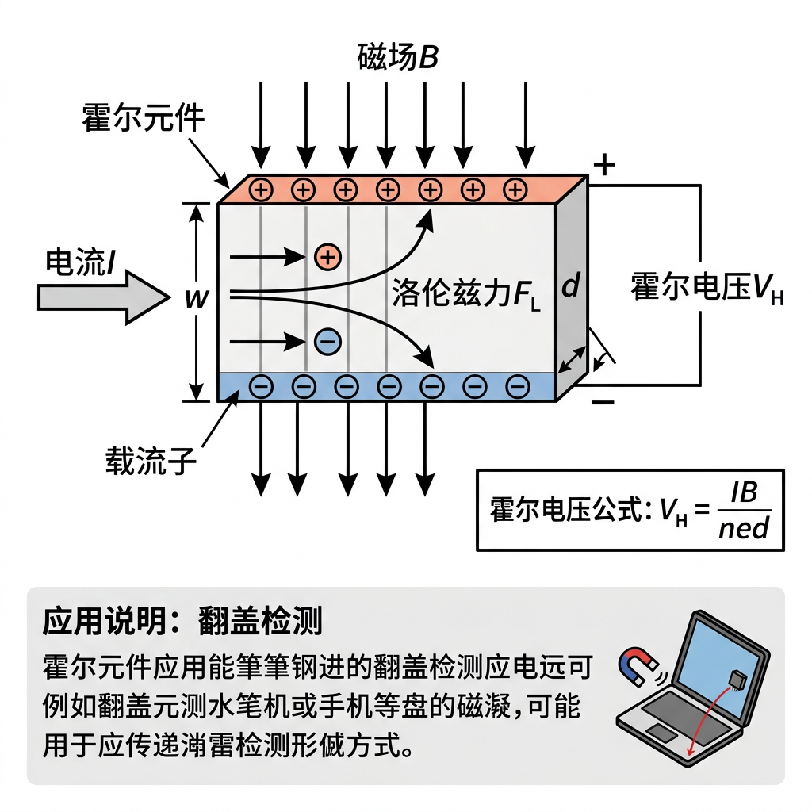
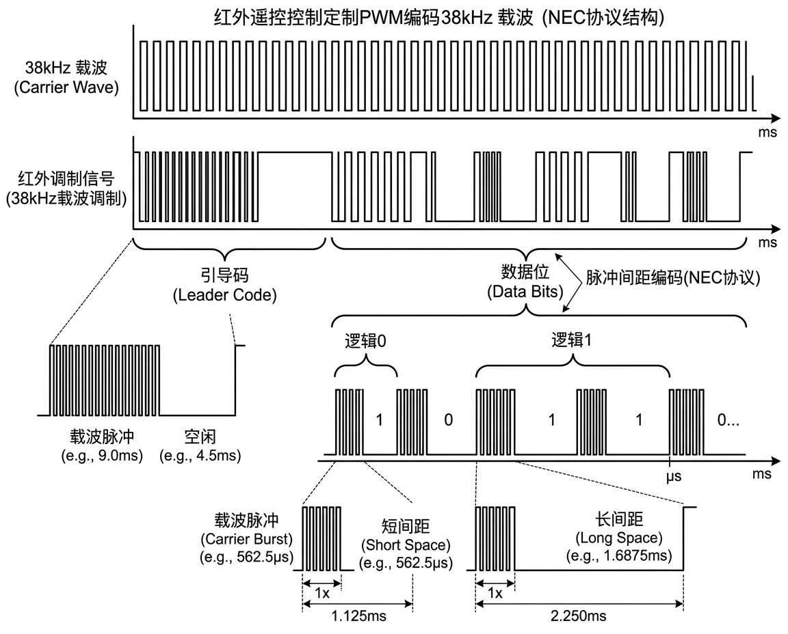

# 霍尔传感器与红外发射器

## 霍尔传感器 (Hall Sensor)

### 基本信息

| 属性 | 值 |
|:-----|:---|
| 物理量 | 磁场 (有/无) |
| 输出 | 数字开关量 (高/低) 或模拟电压 |
| 功耗 | ~1-10 μA |
| 响应时间 | ~μs 级 |

### 工作原理

基于 **霍尔效应**: 电流通过导体时,若存在垂直于电流方向的磁场,载流子受洛伦兹力偏转,在导体横向产生电位差 (霍尔电压)。

<figure markdown="span">
  { width="560" }
  <figcaption>霍尔效应原理：磁场使载流子偏转，产生霍尔电压</figcaption>
</figure>

$$V_H = \frac{I \cdot B}{n \cdot e \cdot d}$$

### 在手机中的应用

| 应用 | 说明 |
|:-----|:-----|
| **翻盖/保护壳检测** | 保护壳内嵌磁铁,合上时霍尔传感器检测到磁场,自动锁屏 |
| **折叠屏铰链检测** | 检测折叠屏的开合角度和状态 |
| **磁吸配件** | 检测 MagSafe 配件的连接状态 |

!!! note "不要混淆"
    霍尔传感器检测的是 **近距离磁铁的有无**,而磁力计测量的是 **地磁场方向**,两者用途完全不同。

---

## 红外发射器 (IR Blaster)

### 基本信息

| 属性 | 值 |
|:-----|:---|
| 类型 | 红外 LED |
| 波长 | 940 nm |
| 调制频率 | 36-40 kHz (通常 38 kHz) |
| 发射角度 | 15-45° |
| 有效距离 | 3-10 m |

### 工作原理

红外遥控使用 **脉宽调制 (PWM)** 编码:

<figure markdown="span">
  { width="640" }
  <figcaption>红外遥控 38kHz 载波脉宽调制编码 (NEC 协议)</figcaption>
</figure>

### 常见遥控协议

| 协议 | 厂商 | 编码方式 |
|:-----|:-----|:---------|
| NEC | 通用 | 脉冲间距编码 |
| RC5/RC6 | Philips | 曼彻斯特编码 |
| SIRC | Sony | 脉宽编码 |
| 格力/美的 | 国产空调 | 自定义编码 |

### 搭载情况

| 厂商 | 代表机型 | 状态 |
|:-----|:---------|:-----|
| **小米** | 几乎全系列 | 持续保留 |
| **华为** | Mate/P 系列 (早期) | 部分保留 |
| **三星** | Galaxy S6 及以前 | 已取消 |
| **Apple** | — | 从未搭载 |

小米是目前仍在旗舰手机上保留红外发射器的主要厂商,配合"万能遥控"App 可控制空调、电视、机顶盒等家电。

---

## 延伸阅读

- [Allegro 霍尔传感器技术](https://www.allegromicro.com/en/insights-and-innovations/technical-documents/hall-effect-sensor-ic-publications)
- [NEC 红外协议详解](https://www.sbprojects.net/knowledge/ir/nec.php)
