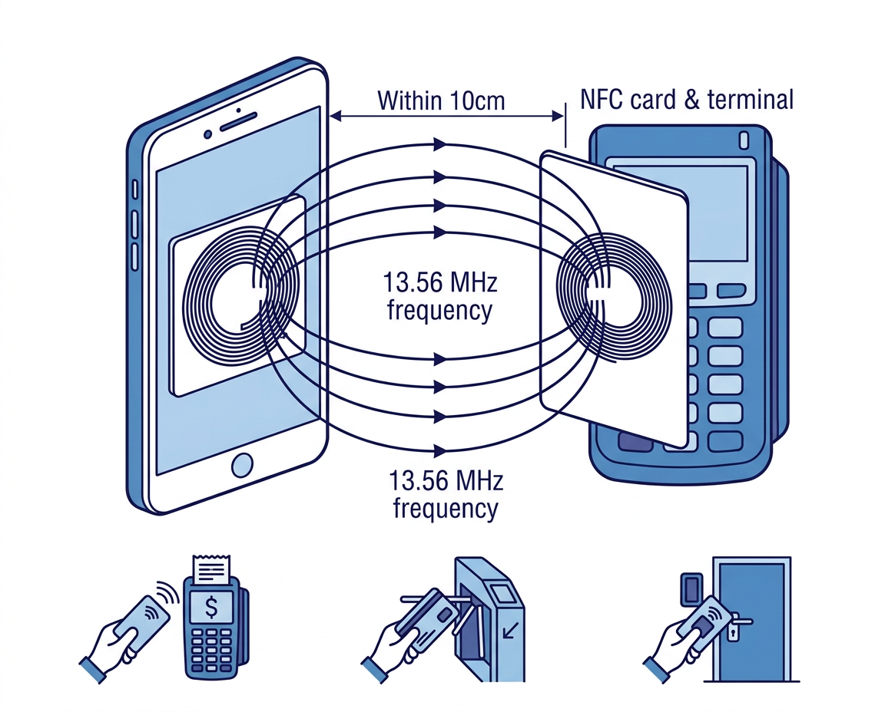

# NFC (Near Field Communication)

## 基本信息

| 属性 | 值 |
|:-----|:---|
| 工作频率 | 13.56 MHz |
| 通信距离 | ≤ 10 cm |
| 数据速率 | 106 / 212 / 424 kbps |
| 标准 | ISO 14443, ISO 18092, ISO 15693 |
| 功耗 | ~15-50 mA (活跃) |
| 典型芯片 | NXP SN220, ST ST25 |

---

## 工作原理

NFC 基于**电磁感应耦合**,工作在 13.56 MHz 频段:

<figure markdown="span">
  { width="640" }
  <figcaption>NFC 近场通信原理：13.56 MHz 电磁感应耦合 (≤ 10cm)</figcaption>
</figure>

### 三种工作模式

| 模式 | 说明 | 应用 |
|:-----|:-----|:-----|
| **读写模式** | 手机读写 NFC 标签 | 读取公交卡余额、NFC 标签 |
| **点对点模式** | 两个 NFC 设备相互通信 | Android Beam (已淘汰) |
| **卡模拟模式** | 手机模拟为 NFC 卡片 | Apple Pay、Google Pay、门禁模拟 |

### 安全元件 (Secure Element)

NFC 支付需要安全元件存储密钥和支付凭证:

| 方案 | 说明 | 使用者 |
|:-----|:-----|:-------|
| **eSE** | 嵌入式安全元件 (独立芯片) | Apple (Apple Pay) |
| **SIM-SE** | SIM 卡内安全元件 | 运营商方案 |
| **HCE** | 主机卡模拟 (软件方案) | Android (Google Pay) |

---

## NDEF 数据格式

**NDEF (NFC Data Exchange Format)** 是 NFC Forum 定义的标准数据封装格式,用于在 NFC 标签和设备之间交换数据。

### NDEF Record 结构

每个 NDEF 消息由一个或多个 **NDEF Record** 组成,每条记录包含:

| 字段 | 长度 | 说明 |
|:-----|:-----|:-----|
| TNF (Type Name Format) | 3 bit | 标识 Type 字段的格式 |
| Type | 可变 | 记录类型 (如 "U" 表示 URI, "T" 表示文本) |
| Payload Length | 1 或 4 字节 | 负载数据长度 |
| Payload | 可变 | 实际数据内容 |

### 常见 TNF 类型

| TNF 值 | 名称 | 说明 |
|:-------|:-----|:-----|
| 0x01 | NFC Forum well-known | 标准类型 (URI, Text, Smart Poster) |
| 0x02 | Media-type (RFC 2046) | MIME 类型 (如 `application/json`) |
| 0x03 | Absolute URI | 完整 URI 作为类型 |
| 0x04 | NFC Forum external | 自定义扩展类型 |

### URI 前缀缩写码

NDEF URI Record 的 Payload 第一个字节是前缀缩写码,可节省存储空间:

| 代码 | 前缀 | 代码 | 前缀 |
|:-----|:-----|:-----|:-----|
| 0x01 | `http://www.` | 0x02 | `https://www.` |
| 0x03 | `http://` | 0x04 | `https://` |
| 0x05 | `tel:` | 0x06 | `mailto:` |

---

## 关键参数解析

### 通信距离与耦合系数

NFC 基于互感耦合,两个线圈之间的互感量:

$$M = k\sqrt{L_1 L_2}$$

其中 $k$ 为耦合系数 (0-1),$L_1, L_2$ 为两个线圈的电感。NFC 工作距离 ≤ 10 cm 时, $k$ 一般在 0.01-0.3 之间。

### 数据速率与调制方式

| 模式 | 速率 | 调制方式 | 编码 |
|:-----|:-----|:---------|:-----|
| NFC-A (106A) | 106 kbps | ASK 100% | Modified Miller |
| NFC-B (106B) | 106 kbps | ASK 10% | NRZ-L |
| NFC-F (212F) | 212 kbps | ASK ±10% | Manchester |
| NFC-F (424F) | 424 kbps | ASK ±10% | Manchester |

### 无源标签供电

NFC 读写器的磁场为无源标签提供工作能量。标签线圈感应电压:

$$V_{induced} = -M \frac{dI}{dt}$$

典型 NFC 标签工作功耗约 1-5 mW,在 13.56 MHz 载波下完全由读写器磁场供电。

---

## 应用实例

### 1. NDEF 消息解析

```python
def parse_ndef_message(raw_bytes):
    """解析 NDEF 消息字节流，返回记录列表
    raw_bytes — NDEF 消息的原始字节 (bytes)
    """
    records = []
    pos = 0
    while pos < len(raw_bytes):
        header = raw_bytes[pos]
        tnf = header & 0x07
        is_short = bool(header & 0x10)       # SR 位
        has_id = bool(header & 0x08)          # IL 位
        pos += 1
        type_len = raw_bytes[pos]; pos += 1
        payload_len = raw_bytes[pos]; pos += 1  # SR=1 时 1 字节
        id_len = raw_bytes[pos] if has_id else 0
        if has_id: pos += 1
        rec_type = raw_bytes[pos:pos+type_len]; pos += type_len
        rec_id = raw_bytes[pos:pos+id_len]; pos += id_len
        payload = raw_bytes[pos:pos+payload_len]; pos += payload_len
        records.append({
            'tnf': tnf, 'type': rec_type, 'payload': payload, 'id': rec_id
        })
    return records

# 示例: 合成一条 NDEF URI Record (https://www.example.com)
ndef_msg = bytes([0xD1, 0x01, 0x0C, 0x55,     # header, type_len=1, payload_len=12, type='U'
                  0x02]) + b'example.com'       # 0x02='https://www.' + 'example.com'
for rec in parse_ndef_message(ndef_msg):
    print(f"  TNF={rec['tnf']}, Type={rec['type']}, Payload={rec['payload']}")
```

### 2. NDEF URI 解码

```python
def decode_ndef_uri(payload):
    """解码 NDEF URI 记录的 payload，返回完整 URI"""
    URI_PREFIXES = {
        0x00: '', 0x01: 'http://www.', 0x02: 'https://www.',
        0x03: 'http://', 0x04: 'https://',
        0x05: 'tel:', 0x06: 'mailto:',
    }
    prefix_code = payload[0]
    prefix = URI_PREFIXES.get(prefix_code, '')
    rest = payload[1:].decode('utf-8', errors='replace')
    return prefix + rest

# 示例
payload = bytes([0x02]) + b'example.com'    # 0x02 = 'https://www.'
print(decode_ndef_uri(payload))              # → https://www.example.com
payload2 = bytes([0x04]) + b'github.com/Zebedee2021'
print(decode_ndef_uri(payload2))             # → https://github.com/Zebedee2021
```

---

## 延伸阅读

- [NFC Forum 技术规范](https://nfc-forum.org/learn/specifications-and-application-documents/)
- [Android NFC 开发指南](https://developer.android.com/develop/connectivity/nfc)
- [Apple Core NFC 文档](https://developer.apple.com/documentation/corenfc)
