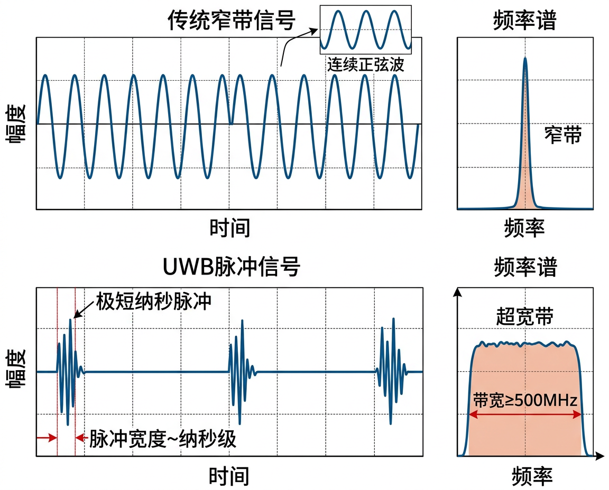
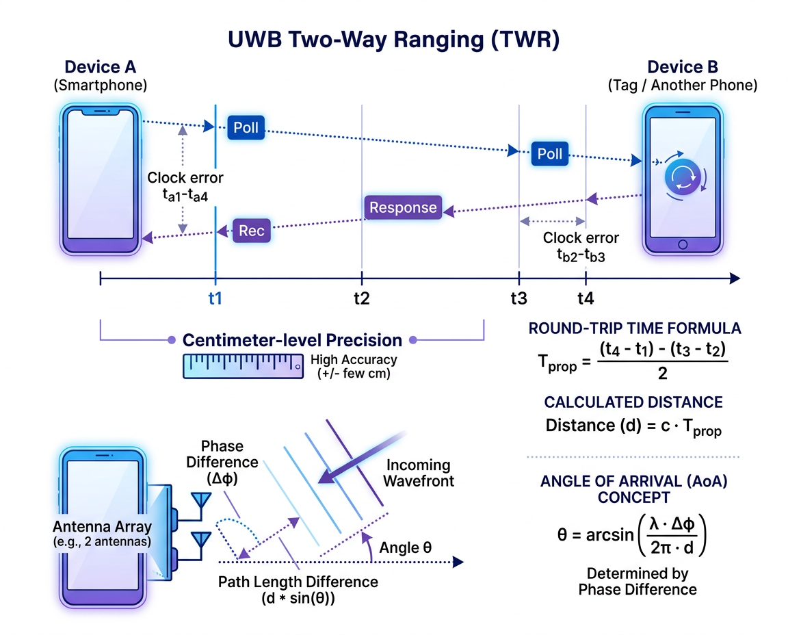

# UWB (Ultra-Wideband)

## 基本信息

| 属性 | 值 |
|:-----|:---|
| 工作频段 | 6.5 GHz / 8 GHz (常用信道) |
| 带宽 | ≥ 500 MHz |
| 通信距离 | ≤ 200 m (视距) |
| 测距精度 | ±5-30 cm |
| 测角精度 | ±3° |
| 标准 | IEEE 802.15.4z |
| 典型芯片 | Apple U2, NXP SR150/SR040, Qorvo DW3720 |

---

## 工作原理

UWB 使用极短的时间脉冲 (纳秒级) 进行通信和测距:

### 脉冲信号特征

<figure markdown="span">
  { width="640" }
  <figcaption>UWB 极短脉冲信号 vs 传统窄带连续信号对比</figcaption>
</figure>

### 双向测距 (TWR)

<figure markdown="span">
  { width="600" }
  <figcaption>UWB 双向测距 (TWR) 原理：通过往返时间精确计算距离</figcaption>
</figure>

### 到达角度 (AoA)

利用天线阵列检测信号到达的相位差,计算来波方向:

$$\theta = \arcsin\left(\frac{c \cdot \Delta t}{d_{antenna}}\right)$$

结合距离和角度,实现 **空间感知** — 不仅知道目标多远,还知道它在哪个方向。

---

## 与其他技术对比

| 技术 | 测距精度 | 测距范围 | 测角 | 功耗 | 穿透性 |
|:-----|:---------|:---------|:-----|:-----|:-------|
| **UWB** | cm 级 | ≤200 m | 支持 | 中 | 可穿墙 |
| Bluetooth | m 级 | ≤100 m | 有限 | 低 | 可穿墙 |
| Wi-Fi RTT | 1-2 m | ≤50 m | 不支持 | 高 | 可穿墙 |
| NFC | — | ≤10 cm | 不支持 | 低 | 不可 |

---

## 应用场景

| 应用 | 说明 |
|:-----|:-----|
| **AirTag / SmartTag 精确查找** | 显示物品的精确方向和距离 |
| **数字车钥匙** | 靠近车门自动解锁,精确判断用户位置 |
| **空间音频** | 追踪头部位置,实现 3D 音效 |
| **近距离文件传输** | 指向对方设备即可传输 |
| **室内定位** | 配合 UWB 锚点实现厘米级室内定位 |

---

## 关键参数解析

### 带宽与测距精度

UWB 的测距精度直接与信号带宽相关。脉冲越短,时间分辨率越高:

$$\Delta d_{min} = \frac{c}{2B}$$

其中 $B$ 为信号带宽。当 $B$ = 500 MHz 时, $\Delta d_{min}$ = 30 cm;实际通过信号处理可达到厘米级精度。

### IEEE 802.15.4z 信道

| 信道号 | 中心频率 | 带宽 | 常见用途 |
|:------|:---------|:-----|:---------|
| 5 | 6489.6 MHz | 499.2 MHz | 欧洲/中国常用 |
| 6 | 6988.8 MHz | 499.2 MHz | 日本/韩国 |
| 9 | 7987.2 MHz | 499.2 MHz | 全球通用,Apple/Samsung 默认 |

### STS 安全机制

IEEE 802.15.4z 引入了 **STS (Scrambled Timestamp Sequence)** 安全扩展,防止中继攻击 (Relay Attack):

- 每次测距使用 **加密随机序列** 作为前导码
- 接收端验证序列合法性,攻击者无法伪造
- 对数字车钥匙等安全场景至关重要

---

## 应用实例

### 1. DS-TWR 双边测距

```python
def twr_ranging(t_round1, t_reply1, t_round2, t_reply2, c=3e8):
    """双边双向测距 (DS-TWR) 距离计算
    t_round1/t_reply1 — 第一轮发起端/响应端的往返时间和回复延迟 (秒)
    t_round2/t_reply2 — 第二轮的往返时间和回复延迟 (秒)
    """
    # DS-TWR 公式消除了时钟偏移的影响
    t_prop = (t_round1 * t_round2 - t_reply1 * t_reply2) / \
             (t_round1 + t_round2 + t_reply1 + t_reply2)
    distance = c * t_prop / 2
    return distance

# 示例: 模拟 3 米距离 (飞行时间 ~10ns)
d = twr_ranging(t_round1=120e-9, t_reply1=100e-9,
                t_round2=120e-9, t_reply2=100e-9)
print(f"测距结果: {d:.2f} m")
```

### 2. 二维三边定位

```python
import numpy as np

def trilateration_2d(anchors, distances):
    """二维三边定位：根据 3+ 个锚点距离计算标签位置
    anchors   — Nx2 数组, 锚点坐标 [(x1,y1), (x2,y2), ...]
    distances — 长度 N 的数组, 到各锚点的测距值
    返回估计位置 (x, y)
    """
    anchors = np.array(anchors, dtype=float)
    distances = np.array(distances, dtype=float)
    n = len(anchors)
    # 以第一个锚点为参考,线性化方程组
    A = np.zeros((n - 1, 2))
    b = np.zeros(n - 1)
    x0, y0, d0 = anchors[0, 0], anchors[0, 1], distances[0]
    for i in range(1, n):
        xi, yi, di = anchors[i, 0], anchors[i, 1], distances[i]
        A[i-1] = [2 * (xi - x0), 2 * (yi - y0)]
        b[i-1] = (d0**2 - di**2) - (x0**2 - xi**2) - (y0**2 - yi**2)
    # 最小二乘求解
    pos, _, _, _ = np.linalg.lstsq(A, b, rcond=None)
    return pos

# 示例: 3 个 UWB 锚点定位
anchors = [(0, 0), (5, 0), (2.5, 4)]
distances = [3.0, 4.0, 2.5]    # 到各锚点的距离 (米)
x, y = trilateration_2d(anchors, distances)
print(f"估计位置: ({x:.2f}, {y:.2f})")
```

---

## 延伸阅读

- [Apple Nearby Interaction 框架](https://developer.apple.com/documentation/nearbyinteraction)
- [Android UWB API](https://developer.android.com/develop/connectivity/uwb)
- [FiRa Consortium (UWB 标准组织)](https://www.firaconsortium.org/)
