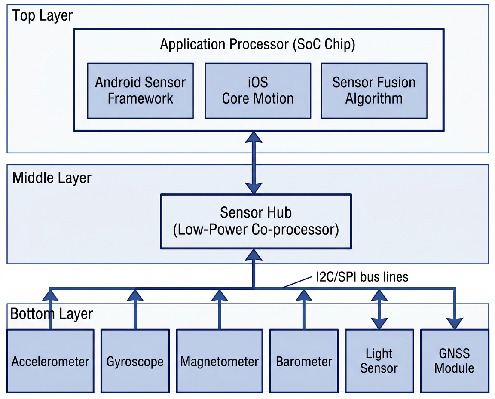

# 传感器总览

## 智能手机传感器发展简史

| 年代 | 里程碑事件 |
|:-----|:----------|
| 2007 | iPhone 初代搭载加速度计,实现自动旋屏 |
| 2008 | Android G1 引入加速度计、指南针 |
| 2010 | iPhone 4 加入陀螺仪,三轴运动感知成为标配 |
| 2013 | iPhone 5s 引入 M7 协处理器,低功耗持续运动追踪;指纹识别 (Touch ID) 首次出现 |
| 2014 | 气压计开始普及,用于楼层检测与海拔辅助 |
| 2017 | iPhone X 引入 Face ID (TrueDepth 结构光),3D 面部识别取代指纹 |
| 2019 | UWB 超宽带芯片 (Apple U1) 首次进入手机 |
| 2020 | iPhone 12 Pro 搭载 LiDAR 扫描仪,dToF 深度感知进入消费级 |
| 2023 | 屏下超声波指纹、大面积 ToF 传感器成为旗舰标配 |

---

## 传感器分类体系

智能手机传感器可从 **物理量类型** 和 **实现方式** 两个维度进行分类:

### 按感知物理量分类

```
智能手机传感器
├── 力学量传感器
│   ├── 加速度计 (线性加速度)
│   ├── 陀螺仪 (角速度)
│   └── 气压计 (大气压力)
├── 电磁量传感器
│   ├── 磁力计 (地磁场)
│   ├── NFC (近场磁耦合)
│   ├── UWB (超宽带射频)
│   └── 霍尔传感器 (磁场)
├── 光学传感器
│   ├── 环境光传感器 (照度)
│   ├── 接近传感器 (红外反射)
│   ├── ToF 传感器 (飞行时间测距)
│   ├── LiDAR (激光雷达)
│   ├── 指纹传感器-光学型 (光学成像)
│   └── 结构光 (3D 面部)
├── 生物信号传感器
│   ├── PPG 心率传感器 (光电脉搏)
│   ├── SpO2 血氧传感器 (双波长)
│   └── 指纹传感器-电容/超声波型
└── 位置传感器
    └── GNSS 接收器 (卫星射频)
```

### 按硬件实现技术分类

| 技术类型 | 说明 | 对应传感器 |
|:---------|:-----|:----------|
| **MEMS** | 微机电系统,硅基微加工 | 加速度计、陀螺仪、气压计 |
| **光电** | 光电转换与光学成像 | 环境光、接近、ToF、LiDAR、光学指纹 |
| **磁敏** | 霍尔效应 / 磁阻效应 | 磁力计、霍尔传感器 |
| **射频** | 电磁波发射与接收 | GNSS、NFC、UWB |
| **压电/超声** | 压电效应产生与检测超声波 | 超声波指纹 |
| **红外** | 红外发射与结构光投影 | 面部识别 (TrueDepth)、红外遥控 |

---

## MEMS 技术基础

!!! info "什么是 MEMS?"
    **MEMS** (Micro-Electro-Mechanical Systems, 微机电系统) 是将微米级的机械结构与电子电路集成在同一硅芯片上的技术。手机中的加速度计、陀螺仪和气压计都是典型的 MEMS 器件。

### MEMS 传感器的基本结构

MEMS 传感器通常包含以下核心部分:

1. **可动质量块 (Proof Mass)**: 硅材料刻蚀而成的微小质量块,悬挂在弹性梁上
2. **弹性悬挂结构 (Suspension)**: 弹簧状的硅梁,允许质量块在特定方向运动
3. **检测电容/压阻**: 将质量块的位移转换为电信号
4. **ASIC 信号处理电路**: 放大、滤波、ADC 转换,输出数字信号

### MEMS 制造工艺

| 工艺 | 说明 |
|:-----|:-----|
| 体微加工 (Bulk Micromachining) | 在硅基片体内刻蚀出三维结构 |
| 表面微加工 (Surface Micromachining) | 在基片表面逐层沉积/刻蚀薄膜 |
| LIGA | 光刻-电铸-注模,适合高深宽比结构 |
| 键合 (Wafer Bonding) | 多层硅片键合形成密封腔体 |

### 主要 MEMS 供应商

| 供应商 | 总部 | 代表产品 |
|:-------|:-----|:---------|
| **Bosch Sensortec** | 德国 | BMA456 (加速度计)、BMI260 (IMU)、BMP390 (气压计) |
| **STMicroelectronics** | 瑞士/意大利 | LSM6DSO (6轴 IMU)、LPS22HH (气压计)、VL53L5CX (ToF) |
| **TDK InvenSense** | 日本/美国 | ICM-42688-P (6轴 IMU)、ICP-10111 (气压计) |
| **AKM (旭化成)** | 日本 | AK09918 (磁力计) |

---

## 传感器系统架构

在手机内部,传感器并非直接连接到主 CPU,而是通过专用的 **传感器中枢 (Sensor Hub)** 进行管理:

<figure markdown="span">
  { width="720" }
  <figcaption>智能手机传感器系统架构：应用处理器 → Sensor Hub → 各传感器</figcaption>
</figure>

### 传感器通信接口

| 接口 | 速率 | 特点 | 使用场景 |
|:-----|:-----|:-----|:---------|
| **I2C** | 100-400 kbps | 两线制,节省引脚 | 光线、接近、磁力计 |
| **SPI** | 1-10 Mbps | 四线制,高速 | IMU (加速度+陀螺仪) |
| **I3C** | 12.5 Mbps | I2C 后继,带内中断 | 新一代传感器 |
| **UART** | 可变 | 串行通信 | GNSS 模块 |

---

## 传感器融合

!!! tip "传感器融合 (Sensor Fusion)"
    单个传感器的数据往往有噪声和漂移,将多个传感器的数据通过算法融合,可以得到更准确、更鲁棒的结果。

### 常见融合组合

| 融合类型 | 输入传感器 | 输出结果 | 典型算法 |
|:---------|:----------|:---------|:---------|
| 9轴融合 | 加速度计 + 陀螺仪 + 磁力计 | 绝对姿态 (四元数/欧拉角) | 互补滤波、Madgwick、EKF |
| 6轴融合 | 加速度计 + 陀螺仪 | 相对姿态 (游戏旋转矢量) | 互补滤波、卡尔曼滤波 |
| 线性加速度 | 加速度计 + 陀螺仪 | 去除重力后的加速度 | 高通滤波 |
| 步态检测 | 加速度计 + 气压计 | 步数 + 楼层变化 | 峰值检测 + 气压差分 |
| 定位融合 | GNSS + IMU + 气压计 | 高精度 3D 位置 | EKF / 粒子滤波 |

### Android 复合传感器

Android 系统内置了多种复合传感器 (Composite Sensors),由底层硬件传感器融合而来:

| 复合传感器 | 来源 | Android 常量 |
|:----------|:-----|:------------|
| 线性加速度 | 加速度计 + 陀螺仪 | `TYPE_LINEAR_ACCELERATION` |
| 重力 | 加速度计 + 陀螺仪 | `TYPE_GRAVITY` |
| 旋转矢量 | 加速度 + 陀螺 + 磁力 | `TYPE_ROTATION_VECTOR` |
| 游戏旋转矢量 | 加速度 + 陀螺仪 | `TYPE_GAME_ROTATION_VECTOR` |
| 地磁旋转矢量 | 加速度 + 磁力计 | `TYPE_GEOMAGNETIC_ROTATION_VECTOR` |
| 计步器 | 加速度计 | `TYPE_STEP_COUNTER` |
| 显著运动 | 加速度计 | `TYPE_SIGNIFICANT_MOTION` |
