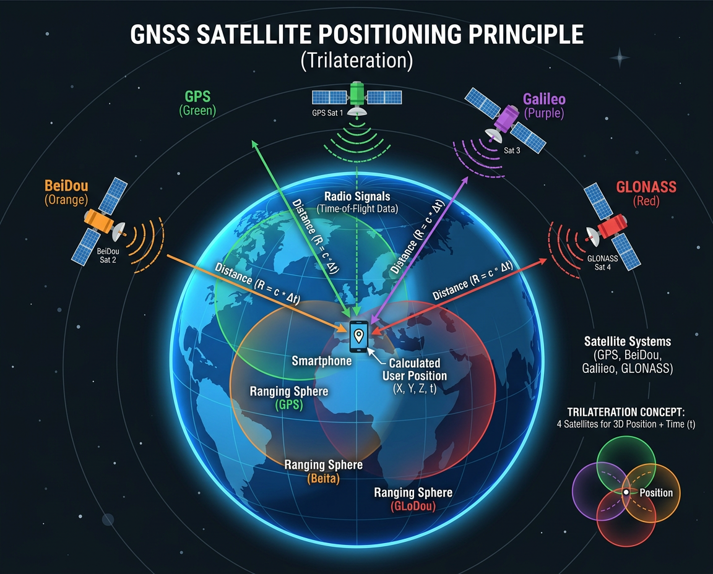
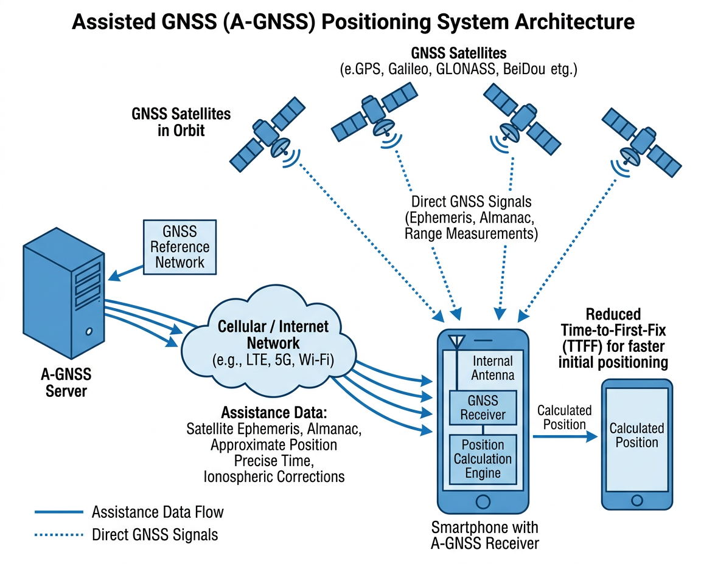

# GNSS 定位 (Global Navigation Satellite System)

<figure markdown="span">
  { width="680" }
  <figcaption>多星座 GNSS 卫星三球交汇定位原理</figcaption>
</figure>

## 基本信息

| 属性 | 值 |
|:-----|:---|
| 物理量 | 位置 (经度、纬度、海拔)、速度、时间 |
| 精度 | 1-5 m (单频), <1 m (双频/RTK) |
| 频段 | L1/L5 (GPS), B1/B2 (BDS) 等 |
| 冷启动时间 | 30-60 s |
| 热启动时间 | 1-5 s |
| 功耗 | ~25-50 mA |
| Android 类 | `LocationManager` / `FusedLocationProviderClient` |
| iOS 框架 | `CLLocationManager` (Core Location) |

---

## 支持的卫星系统

现代手机通常支持多个卫星导航系统的信号,实现多星座联合定位:

| 系统 | 国家/地区 | 卫星数 | 频段 | 覆盖范围 |
|:-----|:----------|:------:|:-----|:---------|
| **GPS** | 美国 | 31 | L1, L5 | 全球 |
| **GLONASS** | 俄罗斯 | 24 | L1, L2 | 全球 |
| **Galileo** | 欧盟 | 28 | E1, E5a, E5b | 全球 |
| **BeiDou (BDS)** | 中国 | 45+ | B1I, B1C, B2a | 全球 |
| **QZSS** | 日本 | 4 | L1, L5 | 亚太 |
| **NavIC (IRNSS)** | 印度 | 7 | L5, S | 印度及周边 |

---

## 定位原理

### 伪距定位

GNSS 定位的基本原理是**三球交汇法**:接收器同时接收至少 4 颗卫星的信号,通过信号传播时间计算到每颗卫星的距离 (伪距):

$$\rho_i = c \cdot (t_{receive} - t_{transmit}) = r_i + c \cdot \delta t$$

其中:

- $\rho_i$ — 到第 $i$ 颗卫星的伪距
- $c$ — 光速 (3×10⁸ m/s)
- $r_i$ — 真实距离
- $\delta t$ — 接收器钟差

需要解 4 个未知数 ($x, y, z, \delta t$),因此至少需要 4 颗卫星。

### 双频定位

传统手机仅接收 L1 单频信号,2018 年起旗舰手机开始支持 **L1+L5 双频**:

| 特性 | 单频 (L1) | 双频 (L1+L5) |
|:-----|:----------|:-------------|
| 精度 | 3-5 m | 0.3-1 m |
| 多径抑制 | 差 | 好 |
| 电离层校正 | 模型修正 | 双频消电离层 |
| 城市峡谷表现 | 差 | 较好 |

### AGNSS (辅助定位)

为加速首次定位时间 (TTFF),手机通过蜂窝网络或 Wi-Fi 下载卫星星历和大致位置:

<figure markdown="span">
  { width="640" }
  <figcaption>AGNSS 辅助定位架构：通过网络下载星历数据加速首次定位</figcaption>
</figure>

---

## 典型芯片

| 芯片/方案 | 厂商 | 频段 | 特点 |
|:---------|:-----|:-----|:-----|
| BCM47765 | Broadcom | L1+L5 双频 | 首个手机双频 GNSS 芯片 |
| Snapdragon 集成 | Qualcomm | L1+L5 | 集成在 SoC 基带中 |
| Exynos 集成 | Samsung | L1+L5 | 集成在 Exynos 基带中 |

---

## 误差来源

| 误差源 | 量级 | 说明 |
|:-------|:-----|:-----|
| 电离层延迟 | 2-10 m | 电离层自由电子使信号减速 |
| 对流层延迟 | 0.5-2 m | 大气水汽折射 |
| 多径效应 | 1-50 m | 信号被建筑物反射后到达 |
| 卫星钟差 | 0.1-1 m | 卫星原子钟误差 |
| 星历误差 | 0.1-1 m | 卫星轨道预报误差 |
| 接收器噪声 | 0.1-1 m | 接收器热噪声 |

!!! tip "城市峡谷问题"
    在高楼密集的城市环境中,GNSS 信号被建筑物遮挡和反射,定位误差可达 10-50 m。手机通常结合 Wi-Fi、蜂窝基站和惯性传感器进行融合定位。

---

## 应用实例

### 1. 伪距定位最小二乘解算

```python
import numpy as np

def pseudorange_position(sat_positions, pseudoranges, x0=None):
    """伪距定位最小二乘解算 (简化版, 2D + 钟差)
    sat_positions — Nx2 数组, 卫星位置 [(x1,y1), ...] (米)
    pseudoranges  — 长度 N 的数组, 伪距观测值 (米)
    x0 — 初始位置估计 [x, y, cdt], 默认原点
    """
    sats = np.array(sat_positions, dtype=float)
    rho = np.array(pseudoranges, dtype=float)
    n = len(sats)
    x = np.array(x0 if x0 else [0.0, 0.0, 0.0])   # [x, y, c*dt]
    for _ in range(10):  # 迭代求解
        r = np.sqrt((sats[:, 0] - x[0])**2 + (sats[:, 1] - x[1])**2)
        H = np.zeros((n, 3))
        H[:, 0] = -(sats[:, 0] - x[0]) / r
        H[:, 1] = -(sats[:, 1] - x[1]) / r
        H[:, 2] = 1.0                                # 钟差列
        delta_rho = rho - (r + x[2])
        dx, _, _, _ = np.linalg.lstsq(H, delta_rho, rcond=None)
        x += dx
        if np.linalg.norm(dx) < 1e-6:
            break
    return x[0], x[1], x[2]    # (x, y, clock_bias)

# 示例: 4 颗卫星定位
sats = [(20000e3, 0), (0, 20000e3), (-15000e3, 15000e3), (10000e3, -18000e3)]
true_pos = (100.0, 200.0)
c_bias = 50.0   # 50m 钟差
rho = [np.sqrt((s[0]-true_pos[0])**2 + (s[1]-true_pos[1])**2) + c_bias for s in sats]
x, y, cb = pseudorange_position(sats, rho)
print(f"估计位置: ({x:.1f}, {y:.1f}), 钟差: {cb:.1f} m")
```

### 2. NMEA GGA 语句解析

```python
def parse_nmea_gga(sentence):
    """解析 NMEA GGA 语句，提取定位信息
    返回 dict: lat, lon, alt, num_sats, quality
    """
    if not sentence.startswith('$GPGGA') and not sentence.startswith('$GNGGA'):
        return None
    fields = sentence.split(',')
    if len(fields) < 15 or fields[6] == '0':
        return None    # 无有效定位
    # 纬度: ddmm.mmmm → 十进制度
    lat_raw, lat_dir = float(fields[2]), fields[3]
    lat = int(lat_raw / 100) + (lat_raw % 100) / 60
    if lat_dir == 'S': lat = -lat
    # 经度: dddmm.mmmm → 十进制度
    lon_raw, lon_dir = float(fields[4]), fields[5]
    lon = int(lon_raw / 100) + (lon_raw % 100) / 60
    if lon_dir == 'W': lon = -lon
    return {
        'lat': lat, 'lon': lon,
        'alt': float(fields[9]) if fields[9] else 0,
        'num_sats': int(fields[7]),
        'quality': int(fields[6]),
    }

# 示例
gga = "$GPGGA,123519,4807.038,N,01131.000,E,1,08,0.9,545.4,M,47.0,M,,*47"
result = parse_nmea_gga(gga)
print(f"纬度: {result['lat']:.4f}°, 经度: {result['lon']:.4f}°, "
      f"海拔: {result['alt']}m, 卫星数: {result['num_sats']}")
```

### 3. Haversine 球面距离

```python
import math

def haversine_distance(lat1, lon1, lat2, lon2):
    """Haversine 公式计算两点间球面距离 (米)
    参数为十进制度数
    """
    R = 6371000    # 地球平均半径 (米)
    phi1, phi2 = math.radians(lat1), math.radians(lat2)
    dphi = math.radians(lat2 - lat1)
    dlam = math.radians(lon2 - lon1)
    a = (math.sin(dphi / 2) ** 2 +
         math.cos(phi1) * math.cos(phi2) * math.sin(dlam / 2) ** 2)
    return R * 2 * math.atan2(math.sqrt(a), math.sqrt(1 - a))

# 示例: 北京天安门 → 上海东方明珠
d = haversine_distance(39.9042, 116.4074, 31.2397, 121.4998)
print(f"北京 → 上海: {d/1000:.1f} km")
```

---

## 延伸阅读

- [GPS.gov — 官方 GPS 信息](https://www.gps.gov/)
- [北斗卫星导航系统](http://www.beidou.gov.cn/)
- [Android 位置服务文档](https://developer.android.com/develop/sensors-and-location/location)
- [Apple Core Location 文档](https://developer.apple.com/documentation/corelocation)
