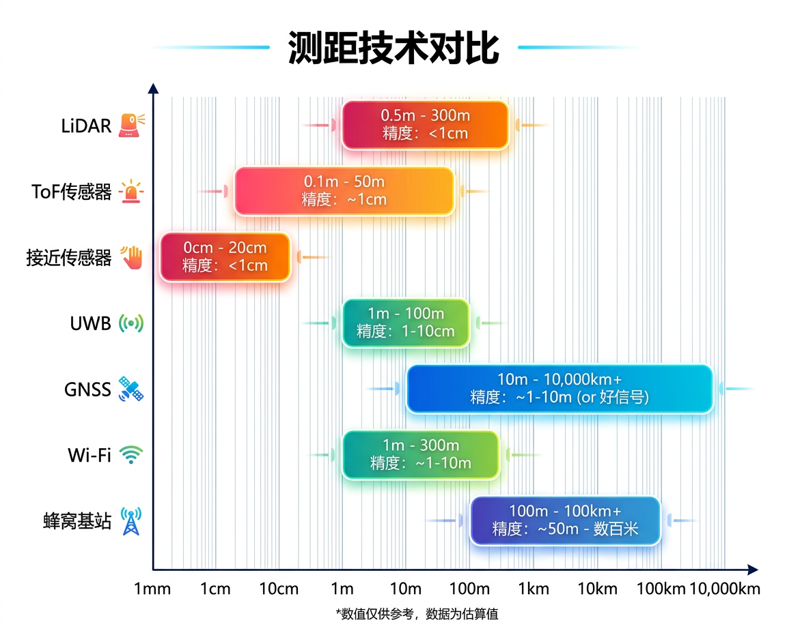

# 位置与距离类传感器

位置与距离类传感器帮助手机确定自身在空间中的位置、检测周围物体的距离。从米级的卫星定位到毫米级的深度感知,覆盖多个数量级。

---

## 本章概要

| 传感器 | 测量对象 | 有效距离 | 精度 | 核心原理 |
|:-------|:---------|:---------|:-----|:---------|
| GNSS 接收器 | 全球位置 | 全球 | 1-5 m (标准), <1 m (RTK) | 卫星信号到达时间差 |
| 接近传感器 | 近距物体 | 0-10 cm | cm 级 | 红外反射强度 |
| ToF 传感器 | 中距物体 | 0-5 m | mm 级 | 激光飞行时间 |
| LiDAR 扫描仪 | 3D 场景 | 0-5 m | mm 级 | dToF 激光阵列扫描 |

---

## 测距技术对比

<figure markdown="span">
  { width="720" }
  <figcaption>各测距技术的有效范围与精度对比</figcaption>
</figure>
