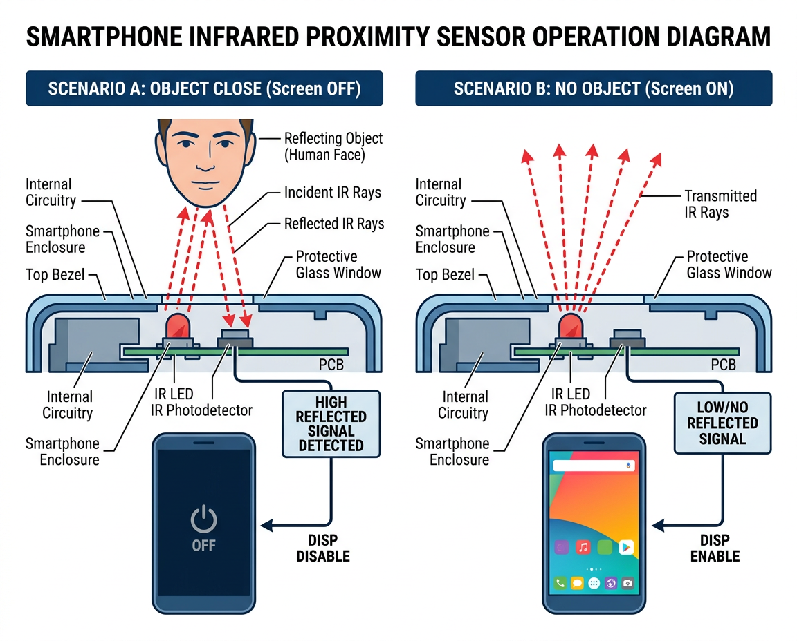

# 接近传感器 (Proximity Sensor)

## 基本信息

| 属性 | 值 |
|:-----|:---|
| 物理量 | 近距物体检测 |
| 检测距离 | 0-10 cm (典型) |
| 输出 | 二值 (近/远) 或连续距离值 |
| 功耗 | ~1-5 mA (活跃), ~1 μA (休眠) |
| Android 常量 | `Sensor.TYPE_PROXIMITY` |
| iOS | 系统级自动管理 |

---

## 工作原理

### 红外反射式

最传统的实现方式,由红外 LED 和光电探测器组成:

<figure markdown="span">
  { width="600" }
  <figcaption>红外反射式接近传感器工作原理：IR LED 发射 → 物体反射 → 光电探测器接收</figcaption>
</figure>

1. IR LED 发射红外光脉冲
2. 若有物体靠近,红外光被反射回来
3. 光电探测器检测反射光强度
4. 强度超过阈值则判定为"近"

### 超声波式

部分机型 (如小米 Mix 系列全面屏) 使用超声波接近传感器:

- 利用扬声器发出超声波,麦克风接收回波
- 不需要在屏幕上开孔,适合全面屏设计
- 响应速度略慢于红外方式

### 电容式

利用人体与传感器之间形成的电容变化来检测接近:

- 适合屏下方案
- 功耗极低
- 受湿度、温度影响较大

---

## 典型芯片

| 芯片型号 | 厂商 | 类型 | 特点 |
|:---------|:-----|:-----|:-----|
| TMD2772 | AMS | 红外 (ALS+Proximity) | 集成环境光+接近 |
| STK3x1x | Sensortek | 红外 | 低成本方案 |
| VL53L0X | ST | ToF 测距 | 精确距离输出 |
| SX9320 | Semtech | 电容式 | SAR 传感器 (比吸收率检测) |

!!! info "SAR 传感器"
    部分手机搭载电容式 SAR (Specific Absorption Rate) 传感器,用于检测人体靠近手机天线的情况,自动降低发射功率以符合辐射安全标准。

---

## 关键参数解析

### 检测距离与灵敏度

红外反射式传感器的接收光强遵循近似的逆平方关系:

$$I_{recv} \propto \frac{P_{emit}}{r^2}$$

实际检测距离受物体反射率影响较大 — 白纸的反射率 (~90%) 远高于深色衣物 (~5%),导致同一传感器对不同物体的有效距离差异显著。

### 响应时间对比

| 参数 | 红外反射式 | 超声波式 | 电容式 |
|:-----|:----------|:---------|:-------|
| 响应时间 | 1-5 ms | 10-50 ms | 5-20 ms |
| 检测距离 | 1-10 cm | 2-30 cm | 1-5 cm |
| 受环境光影响 | 有 (需调制) | 无 | 无 |
| 受材质影响 | 大 (反射率) | 小 | 仅导体 |
| 功耗 | 中 (mA级) | 高 | 极低 (μA级) |

### 串扰补偿

红外接近传感器中,LED 发出的光可能直接泄漏到旁边的探测器 (光学串扰),产生固定偏移。芯片通常内置 **串扰校准** (Crosstalk Calibration) 功能:

1. 在无遮挡环境下,测量背景串扰值
2. 将此值存入寄存器作为基线
3. 后续读数减去基线,消除固定偏移

---

## 应用实例

### 1. 迟滞阈值接近检测

```python
def proximity_threshold_detector(signal, threshold_near=200, threshold_far=100):
    """迟滞阈值接近检测算法，避免近/远状态频繁跳变 (Schmitt 触发)
    signal — 接近传感器原始 ADC 读数列表 (值越大表示越近)
    """
    is_near = False
    events = []
    for i, value in enumerate(signal):
        if not is_near and value >= threshold_near:
            is_near = True
            events.append((i, 'NEAR', value))
        elif is_near and value <= threshold_far:
            is_near = False
            events.append((i, 'FAR', value))
    return events

# 示例: 模拟手接近又离开的传感器读数
readings = [20, 50, 120, 180, 250, 220, 150, 80, 60, 30, 15]
for idx, state, val in proximity_threshold_detector(readings):
    print(f"  采样 {idx}: {state} (ADC={val})")
```

### 2. 超声波回波测距

```python
def ultrasonic_distance(echo_times, speed_of_sound=343.0):
    """超声波测距：根据回波往返时间计算距离
    echo_times — [(发射时间, 接收时间), ...] 列表 (单位: 秒)
    speed_of_sound — 声速 (m/s, 默认 20°C 空气中)
    """
    distances = []
    for t_emit, t_recv in echo_times:
        dt = t_recv - t_emit
        d_cm = (speed_of_sound * dt / 2) * 100   # 转为 cm
        distances.append(round(d_cm, 1))
    return distances

# 示例: 3 次测量 (发射时间, 接收时间)
samples = [(0.000, 0.00058), (0.100, 0.10062), (0.200, 0.20055)]
dists = ultrasonic_distance(samples)
for i, d in enumerate(dists):
    print(f"  测量 {i+1}: {d} cm")
print(f"  平均距离: {sum(dists)/len(dists):.1f} cm")
```

---

## 延伸阅读

- [AMS TMD2772 数据手册](https://ams.com/tmd27721)
- [Android TYPE_PROXIMITY 文档](https://developer.android.com/reference/android/hardware/Sensor#TYPE_PROXIMITY)
