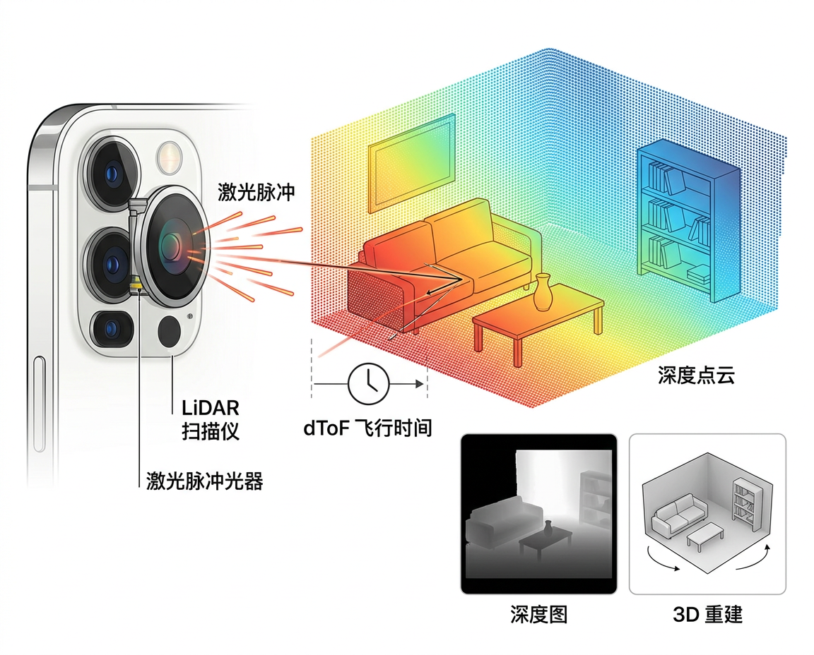
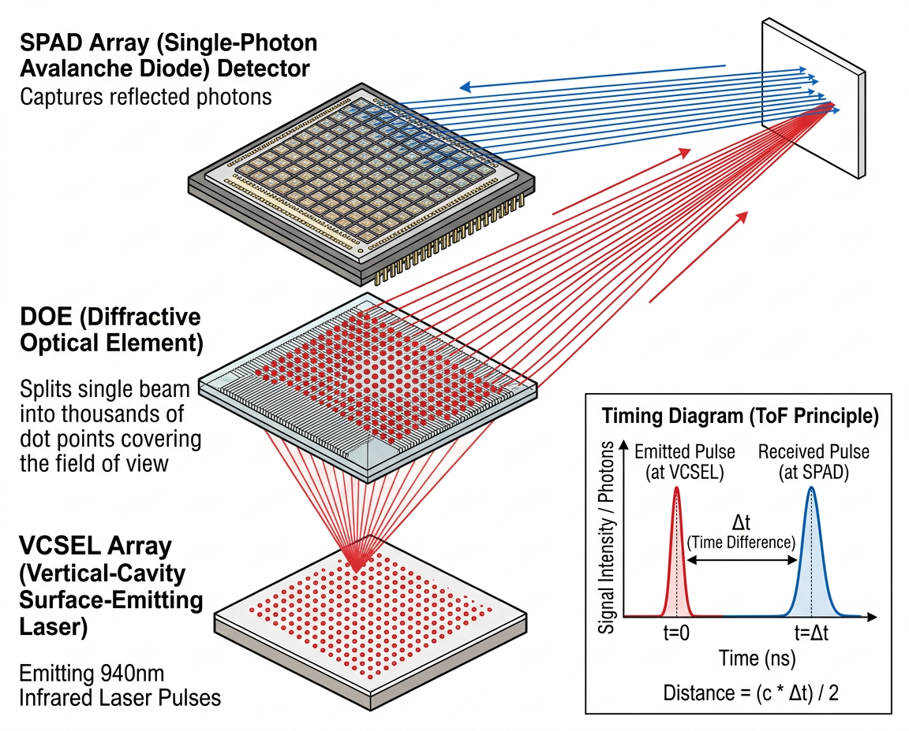

# ToF 与 LiDAR

<figure markdown="span">
  { width="680" }
  <figcaption>智能手机 LiDAR 扫描仪的深度感知原理</figcaption>
</figure>

## ToF 传感器 (Time of Flight)

### 基本信息

| 属性 | 值 |
|:-----|:---|
| 物理量 | 距离 (深度) |
| 量程 | 0.02-5 m (典型) |
| 单位 | mm |
| 精度 | ±1-5% |
| 帧率 | 15-60 fps |
| Android 类 | `CameraCharacteristics.REQUEST_AVAILABLE_CAPABILITIES_DEPTH_OUTPUT` |

### 工作原理

ToF 传感器通过测量光脉冲从发射到返回的时间来计算距离:

$$d = \frac{c \cdot t}{2}$$

其中 $c$ 为光速,$t$ 为往返时间。

#### dToF (Direct ToF)

直接测量光脉冲的往返时间:

```
发射 ──┤├──────────────────────────────┤├── 接收
       t₁                              t₂
       
       d = c × (t₂ - t₁) / 2
```

- 使用 **SPAD (单光子雪崩二极管)** 检测器
- 精度高,抗环境光干扰能力强
- Apple LiDAR 采用此方案

#### iToF (Indirect ToF)

发射连续调制光波,测量反射光的**相位差**:

$$d = \frac{c \cdot \Delta\varphi}{4\pi f}$$

- 结构相对简单
- 受多径干扰影响较大
- 早期 Android ToF 相机多用此方案

### 典型芯片

| 芯片型号 | 厂商 | 类型 | 特点 |
|:---------|:-----|:-----|:-----|
| VL53L5CX | ST | dToF (8×8 区域) | 多区域测距,FOV 63° |
| VL53L1X | ST | dToF (单点) | 4m 量程,小体积 |
| S5K33D | Samsung | iToF (VGA) | 高分辨率深度图 |
| IMX316 | Sony | iToF (CIF) | 背照式 ToF 像素 |

---

## LiDAR 扫描仪

### 基本信息

| 属性 | 值 |
|:-----|:---|
| 类型 | dToF 面阵激光雷达 |
| 量程 | 0-5 m |
| 精度 | ~1% (约 mm 级) |
| 扫描点数 | 数万点/帧 |
| 帧率 | ~15-30 fps |
| 搭载设备 | iPhone 12 Pro+, iPad Pro 2020+ |

### 硬件结构

Apple LiDAR 扫描仪由三个核心组件构成:

<figure markdown="span">
  { width="640" }
  <figcaption>Apple LiDAR 扫描仪硬件结构：VCSEL 激光阵列 + DOE 衍射元件 + SPAD 探测器阵列</figcaption>
</figure>

- **VCSEL (垂直腔面发射激光器)**: 发射 940nm 近红外激光脉冲
- **DOE (衍射光学元件)**: 将激光分成数千个点,覆盖整个视场
- **SPAD 阵列**: 单光子灵敏度的探测器阵列,精确记录每个点的返回时间

### 与结构光的对比

| 特性 | LiDAR (dToF) | 结构光 (Structured Light) |
|:-----|:-------------|:-------------------------|
| 原理 | 激光飞行时间 | 红外点阵投影 + 三角测量 |
| 量程 | 0-5 m | 0.2-0.8 m |
| 环境适应 | 室内外均可 | 强光下性能下降 |
| 精度 | mm 级 | 亚 mm 级 (近距) |
| 主要用途 | AR、3D 扫描 | Face ID 面部识别 |
| 搭载位置 | 后置摄像头模组 | 前置 TrueDepth 模组 |

### 应用场景

| 应用 | 说明 |
|:-----|:-----|
| AR 遮挡 | 虚拟物体被真实物体遮挡的正确渲染 |
| 场景重建 | 实时 3D mesh 生成 |
| 家具预览 | AR 购物中的家具放置 |
| 夜间对焦 | 暗光环境下辅助相机快速对焦 |
| 测量工具 | Apple 测距仪 App 精确测量物体尺寸 |

---

## 关键参数解析

### 深度分辨率

深度分辨率指传感器能区分的最小距离变化:

| 传感器类型 | 空间分辨率 | 深度精度 | 典型产品 |
|:-----------|:----------|:---------|:---------|
| 单点 dToF | 1×1 | ±3mm @2m | VL53L1X |
| 多区域 dToF | 8×8 (64区域) | ±5mm @2m | VL53L5CX |
| iToF 相机 | VGA (640×480) | ±1% @1m | S5K33D |
| LiDAR 面阵 | 数万点 | ~1mm @1m | Apple LiDAR |

### 帧率与功耗折衷

帧率越高,每帧积分时间越短,需要更大的激光功率才能维持信噪比:

| 帧率 | 积分时间 | 典型功耗 | 适用场景 |
|:-----|:---------|:---------|:---------|
| 1 fps | 长 | ~5 mW | 静态测距、物流 |
| 15 fps | 中 | ~50 mW | AR 遮挡渲染 |
| 30 fps | 短 | ~100 mW | 实时手势交互 |
| 60 fps | 极短 | ~200 mW | 高速运动追踪 |

### 多径干扰 (iToF)

iToF 测量相位差,但当光在场景中多次反射后到达探测器时,测量相位为多条路径的加权叠加,导致距离偏差。此外,iToF 存在 **相位缠绕** 问题 — 超过最大无歧义距离后相位会重复:

$$d_{max} = \frac{c}{2 f_{mod}}$$

例如调制频率 $f_{mod}$ = 20 MHz 时, $d_{max}$ = 7.5 m。超过此距离的物体会被错误地映射为更近的距离。dToF 由于直接计时,不存在相位缠绕问题。

---

## 应用实例

### 1. ToF 深度图模拟与可视化

```python
import numpy as np

def generate_depth_map(rows=8, cols=8, bg_dist=2000, obj_dist=500):
    """模拟 VL53L5CX 8×8 多区域 ToF 深度图 (单位: mm)
    bg_dist — 背景距离, obj_dist — 前景物体距离
    """
    depth = np.full((rows, cols), bg_dist, dtype=float)
    # 在左上角放置一个 3×3 的近距物体
    depth[1:4, 1:4] = obj_dist + np.random.normal(0, 20, (3, 3))
    # 加入测量噪声
    depth += np.random.normal(0, 10, (rows, cols))
    return np.clip(depth, 0, 5000)

def visualize_depth_map(depth_map):
    """文字方式可视化深度图，距离越近字符越密"""
    symbols = '█▓▒░ '    # 近 → 远
    d_min, d_max = depth_map.min(), depth_map.max()
    for row in depth_map:
        line = ''
        for d in row:
            idx = int((d - d_min) / (d_max - d_min + 1e-6) * (len(symbols) - 1))
            line += symbols[idx] * 2
        print(line)

# 示例
dm = generate_depth_map()
visualize_depth_map(dm)
```

### 2. 深度图障碍物检测

```python
import numpy as np

def detect_obstacles(depth_map, threshold_mm=500):
    """深度图障碍物检测：标记距离小于阈值的区域
    返回 (obstacle_map, closest_mm, obstacle_ratio)
    """
    obstacle_map = depth_map < threshold_mm
    closest_mm = float(depth_map.min())
    total_zones = depth_map.size
    obstacle_zones = int(np.sum(obstacle_map))
    obstacle_ratio = obstacle_zones / total_zones
    print(f"最近距离: {closest_mm:.0f} mm")
    print(f"障碍物区域: {obstacle_zones}/{total_zones} ({obstacle_ratio:.1%})")
    if obstacle_ratio > 0.3:
        print("⚠ 警告: 大面积近距物体")
    return obstacle_map, closest_mm, obstacle_ratio
```

---

## 延伸阅读

- [ST VL53L5CX 数据手册](https://www.st.com/en/imaging-and-photonics-solutions/vl53l5cx.html)
- [Apple LiDAR Scanner 技术概述](https://developer.apple.com/augmented-reality/)
- [Apple ARKit 深度 API](https://developer.apple.com/documentation/arkit/arframe/3566299-scenedepth)
